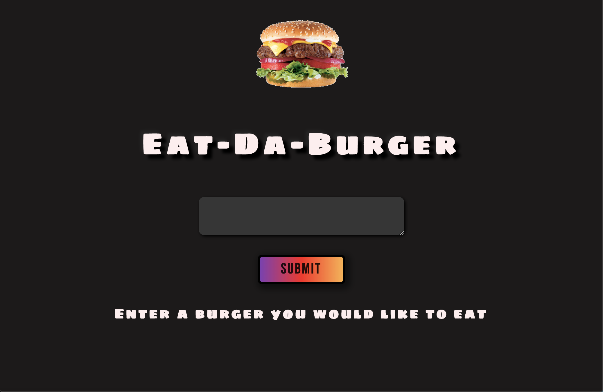

# Burger-Log
 A burger logger with MySQL, Node, Express, Handlebars and Sequelize . Following the MVC design pattern; using Node and MySQL to query and route data into the app, and Handlebars to generate HTML.

